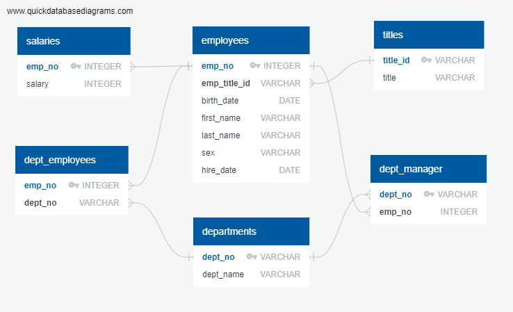

# sql-challenge

## Background
Ask: Designed ERD and created six relational tables within pgAdmin to house HP employee data. Performed data modeling and data analysis on the data using SQL.

## Description
#### Data Modeling 
Inspected data and sketched out an ERD of the tables. See [ERD](EmployeeSQL/HP_Employee_ERD.png). 

#### Data Engineering 
Created table schema specifying data types, primary keys, foreign keys, composite key and other constraints. See [schema](EmployeeSQL/schema.sql).

#### Data Analysis
Used SQL to analyze employee data. See [queries](queries.sql).

